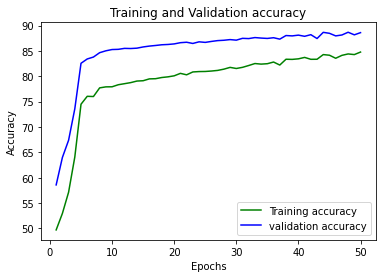
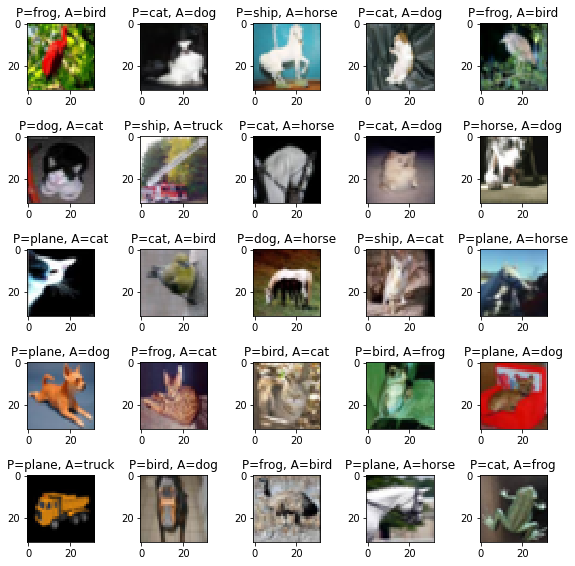
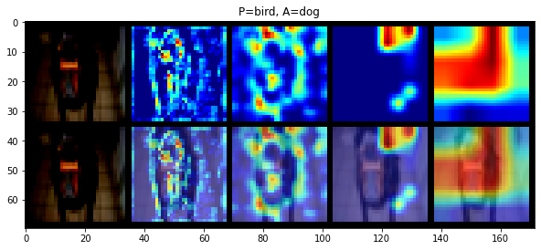
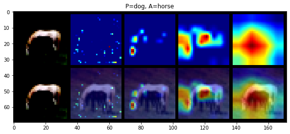

## CIFAR 10 dataset visualization using Resnet 18 CNN model , albumentation image augmentation , LR finder , 

### Authors

* **Deepak Hazarika** 
* **Parinita Bora**
* **Gurudatta**
* 
10/3/2020 10:39:12 PM 

----------

## Source code 

Source code for the above modules are in git package

1.  https://github.com/tfdeepnet/visionlib/tree/master/utils
2.  https://github.com/tfdeepnet/visionlib/tree/master/models

## Resnet model performance

Training accuracy : **84.34%**

Test Accuracy : **88.6%**

## Class Accuracy

| Class | Accuracy |
| ----- | -------- |
| plane | 90%      |
|  car  | 95%      |
| bird  | 83%      |
|  cat  | 74%      |
| deer  | 89%      |
|  dog  | 75%      |
| frog  | 94%      |
| horse | 91%      |
| ship  | 95%      |
| truck | 94%      |

## Misclassified image

- Few images which were misclassified

## Grad cam of misclassified image

Grad cam of misclassified Dog image

Grad cam of misclassified Horse image

## Training log

  0%|          | 0/391 [00:00<?, ?it/s]Epoch: 1 LR: 0.0038474265772585033
Loss=1.3753328323364258 Batch_id=390 Accuracy=41.85: 100%|██████████| 391/391 [01:04<00:00,  6.06it/s]

Test set: Average loss: 0.0093, Accuracy: 5858/10000 (58.58%)

  0%|          | 0/391 [00:00<?, ?it/s]Epoch: 2 LR: 0.0038474265772585033
Loss=1.0733284950256348 Batch_id=390 Accuracy=58.39: 100%|██████████| 391/391 [01:04<00:00,  6.06it/s]

Test set: Average loss: 0.0081, Accuracy: 6398/10000 (63.98%)

  0%|          | 0/391 [00:00<?, ?it/s]Epoch: 3 LR: 0.0038474265772585033
Loss=1.0811073780059814 Batch_id=390 Accuracy=64.02: 100%|██████████| 391/391 [01:04<00:00,  6.03it/s]

Test set: Average loss: 0.0073, Accuracy: 6739/10000 (67.39%)

  0%|          | 0/391 [00:00<?, ?it/s]Epoch: 4 LR: 0.0038474265772585033
Loss=0.8335278630256653 Batch_id=390 Accuracy=67.09: 100%|██████████| 391/391 [01:04<00:00,  6.06it/s]

Test set: Average loss: 0.0061, Accuracy: 7358/10000 (73.58%)

  0%|          | 0/391 [00:00<?, ?it/s]Epoch: 5 LR: 0.00038474265772585033
Loss=0.6821111440658569 Batch_id=390 Accuracy=72.58: 100%|██████████| 391/391 [01:04<00:00,  6.05it/s]

Test set: Average loss: 0.0040, Accuracy: 8256/10000 (82.56%)

  0%|          | 0/391 [00:00<?, ?it/s]Epoch: 6 LR: 0.00038474265772585033
Loss=0.7361990809440613 Batch_id=390 Accuracy=74.68: 100%|██████████| 391/391 [01:04<00:00,  6.06it/s]

Test set: Average loss: 0.0038, Accuracy: 8341/10000 (83.41%)

  0%|          | 0/391 [00:00<?, ?it/s]Epoch: 7 LR: 0.00038474265772585033
Loss=0.9723490476608276 Batch_id=390 Accuracy=75.62: 100%|██████████| 391/391 [01:04<00:00,  6.05it/s]

Test set: Average loss: 0.0037, Accuracy: 8379/10000 (83.79%)

  0%|          | 0/391 [00:00<?, ?it/s]Epoch: 8 LR: 0.0001
Loss=0.7198494672775269 Batch_id=390 Accuracy=76.89: 100%|██████████| 391/391 [01:04<00:00,  6.06it/s]

Test set: Average loss: 0.0035, Accuracy: 8465/10000 (84.65%)

  0%|          | 0/391 [00:00<?, ?it/s]Epoch: 9 LR: 0.0001
Loss=0.7850466966629028 Batch_id=390 Accuracy=77.08: 100%|██████████| 391/391 [01:04<00:00,  6.05it/s]

Test set: Average loss: 0.0035, Accuracy: 8502/10000 (85.02%)

  0%|          | 0/391 [00:00<?, ?it/s]Epoch: 10 LR: 0.0001
Loss=0.6626682281494141 Batch_id=390 Accuracy=77.46: 100%|██████████| 391/391 [01:04<00:00,  6.07it/s]

Test set: Average loss: 0.0034, Accuracy: 8527/10000 (85.27%)

  0%|          | 0/391 [00:00<?, ?it/s]Epoch: 11 LR: 0.0001
Loss=0.6013997197151184 Batch_id=390 Accuracy=77.62: 100%|██████████| 391/391 [01:04<00:00,  6.06it/s]

Test set: Average loss: 0.0034, Accuracy: 8531/10000 (85.31%)

  0%|          | 0/391 [00:00<?, ?it/s]Epoch: 12 LR: 0.0001
Loss=0.6730393171310425 Batch_id=390 Accuracy=77.77: 100%|██████████| 391/391 [01:04<00:00,  6.07it/s]

Test set: Average loss: 0.0034, Accuracy: 8550/10000 (85.50%)

  0%|          | 0/391 [00:00<?, ?it/s]Epoch: 13 LR: 0.0001
Loss=0.7388104200363159 Batch_id=390 Accuracy=78.04: 100%|██████████| 391/391 [01:04<00:00,  6.06it/s]

Test set: Average loss: 0.0033, Accuracy: 8547/10000 (85.47%)

  0%|          | 0/391 [00:00<?, ?it/s]Epoch: 14 LR: 0.0001
Loss=0.6825569868087769 Batch_id=390 Accuracy=78.37: 100%|██████████| 391/391 [01:04<00:00,  6.08it/s]

Test set: Average loss: 0.0033, Accuracy: 8554/10000 (85.54%)

  0%|          | 0/391 [00:00<?, ?it/s]Epoch: 15 LR: 0.0001
Loss=0.5870542526245117 Batch_id=390 Accuracy=78.78: 100%|██████████| 391/391 [01:04<00:00,  6.08it/s]

Test set: Average loss: 0.0033, Accuracy: 8578/10000 (85.78%)

  0%|          | 0/391 [00:00<?, ?it/s]Epoch: 16 LR: 0.0001
Loss=0.5619879961013794 Batch_id=390 Accuracy=78.62: 100%|██████████| 391/391 [01:04<00:00,  6.06it/s]

Test set: Average loss: 0.0032, Accuracy: 8595/10000 (85.95%)

  0%|          | 0/391 [00:00<?, ?it/s]Epoch: 17 LR: 0.0001
Loss=0.6910077333450317 Batch_id=390 Accuracy=78.64: 100%|██████████| 391/391 [01:04<00:00,  6.07it/s]

Test set: Average loss: 0.0032, Accuracy: 8607/10000 (86.07%)

  0%|          | 0/391 [00:00<?, ?it/s]Epoch: 18 LR: 0.0001
Loss=0.5318809747695923 Batch_id=390 Accuracy=79.17: 100%|██████████| 391/391 [01:04<00:00,  6.08it/s]

Test set: Average loss: 0.0033, Accuracy: 8621/10000 (86.21%)

  0%|          | 0/391 [00:00<?, ?it/s]Epoch: 19 LR: 0.0001
Loss=0.6488356590270996 Batch_id=390 Accuracy=79.04: 100%|██████████| 391/391 [01:04<00:00,  6.08it/s]

Test set: Average loss: 0.0031, Accuracy: 8627/10000 (86.27%)

  0%|          | 0/391 [00:00<?, ?it/s]Epoch: 20 LR: 0.0001
Loss=0.6983246207237244 Batch_id=390 Accuracy=78.94: 100%|██████████| 391/391 [01:04<00:00,  6.08it/s]

Test set: Average loss: 0.0032, Accuracy: 8638/10000 (86.38%)

  0%|          | 0/391 [00:00<?, ?it/s]Epoch: 21 LR: 0.0001
Loss=0.6072720289230347 Batch_id=390 Accuracy=79.57: 100%|██████████| 391/391 [01:04<00:00,  6.08it/s]

Test set: Average loss: 0.0031, Accuracy: 8662/10000 (86.62%)

  0%|          | 0/391 [00:00<?, ?it/s]Epoch: 22 LR: 0.0001
Loss=0.5095802545547485 Batch_id=390 Accuracy=79.88: 100%|██████████| 391/391 [01:04<00:00,  6.08it/s]

Test set: Average loss: 0.0031, Accuracy: 8671/10000 (86.71%)

  0%|          | 0/391 [00:00<?, ?it/s]Epoch: 23 LR: 0.0001
Loss=0.5787743926048279 Batch_id=390 Accuracy=80.07: 100%|██████████| 391/391 [01:04<00:00,  6.09it/s]

Test set: Average loss: 0.0031, Accuracy: 8647/10000 (86.47%)

  0%|          | 0/391 [00:00<?, ?it/s]Epoch: 24 LR: 0.0001
Loss=0.46584028005599976 Batch_id=390 Accuracy=80.43: 100%|██████████| 391/391 [01:04<00:00,  6.07it/s]

Test set: Average loss: 0.0030, Accuracy: 8679/10000 (86.79%)

  0%|          | 0/391 [00:00<?, ?it/s]Epoch: 25 LR: 0.0001
Loss=0.5583087205886841 Batch_id=390 Accuracy=80.43: 100%|██████████| 391/391 [01:04<00:00,  6.05it/s]

Test set: Average loss: 0.0031, Accuracy: 8668/10000 (86.68%)

  0%|          | 0/391 [00:00<?, ?it/s]Epoch: 26 LR: 0.0001
Loss=0.6336607933044434 Batch_id=390 Accuracy=80.41: 100%|██████████| 391/391 [01:04<00:00,  6.06it/s]

Test set: Average loss: 0.0030, Accuracy: 8687/10000 (86.87%)

  0%|          | 0/391 [00:00<?, ?it/s]Epoch: 27 LR: 0.0001
Loss=0.6018742918968201 Batch_id=390 Accuracy=80.94: 100%|██████████| 391/391 [01:04<00:00,  6.06it/s]

Test set: Average loss: 0.0030, Accuracy: 8703/10000 (87.03%)

  0%|          | 0/391 [00:00<?, ?it/s]Epoch: 28 LR: 0.0001
Loss=0.4188395142555237 Batch_id=390 Accuracy=81.03: 100%|██████████| 391/391 [01:04<00:00,  6.08it/s]

Test set: Average loss: 0.0030, Accuracy: 8710/10000 (87.10%)

  0%|          | 0/391 [00:00<?, ?it/s]Epoch: 29 LR: 0.0001
Loss=0.5444439649581909 Batch_id=390 Accuracy=81.01: 100%|██████████| 391/391 [01:04<00:00,  6.06it/s]

Test set: Average loss: 0.0029, Accuracy: 8723/10000 (87.23%)

  0%|          | 0/391 [00:00<?, ?it/s]Epoch: 30 LR: 0.0001
Loss=0.6400378942489624 Batch_id=390 Accuracy=81.29: 100%|██████████| 391/391 [01:04<00:00,  6.05it/s]

Test set: Average loss: 0.0030, Accuracy: 8712/10000 (87.12%)

  0%|          | 0/391 [00:00<?, ?it/s]Epoch: 31 LR: 0.0001
Loss=0.5289729833602905 Batch_id=390 Accuracy=81.29: 100%|██████████| 391/391 [01:04<00:00,  6.07it/s]

Test set: Average loss: 0.0029, Accuracy: 8748/10000 (87.48%)

  0%|          | 0/391 [00:00<?, ?it/s]Epoch: 32 LR: 0.0001
Loss=0.6471609473228455 Batch_id=390 Accuracy=81.60: 100%|██████████| 391/391 [01:04<00:00,  6.07it/s]

Test set: Average loss: 0.0029, Accuracy: 8743/10000 (87.43%)

  0%|          | 0/391 [00:00<?, ?it/s]Epoch: 33 LR: 0.0001
Loss=0.5634828209877014 Batch_id=390 Accuracy=81.91: 100%|██████████| 391/391 [01:04<00:00,  6.06it/s]

Test set: Average loss: 0.0029, Accuracy: 8763/10000 (87.63%)

  0%|          | 0/391 [00:00<?, ?it/s]Epoch: 34 LR: 0.0001
Loss=0.49017539620399475 Batch_id=390 Accuracy=82.02: 100%|██████████| 391/391 [01:04<00:00,  6.04it/s]

Test set: Average loss: 0.0029, Accuracy: 8753/10000 (87.53%)

  0%|          | 0/391 [00:00<?, ?it/s]Epoch: 35 LR: 0.0001
Loss=0.4794551432132721 Batch_id=390 Accuracy=82.26: 100%|██████████| 391/391 [01:04<00:00,  6.05it/s]

Test set: Average loss: 0.0029, Accuracy: 8746/10000 (87.46%)

  0%|          | 0/391 [00:00<?, ?it/s]Epoch: 36 LR: 0.0001
Loss=0.49800652265548706 Batch_id=390 Accuracy=81.98: 100%|██████████| 391/391 [01:04<00:00,  6.05it/s]

Test set: Average loss: 0.0029, Accuracy: 8760/10000 (87.60%)

  0%|          | 0/391 [00:00<?, ?it/s]Epoch: 37 LR: 0.0001
Loss=0.45988911390304565 Batch_id=390 Accuracy=82.44: 100%|██████████| 391/391 [01:04<00:00,  6.06it/s]

Test set: Average loss: 0.0029, Accuracy: 8732/10000 (87.32%)

  0%|          | 0/391 [00:00<?, ?it/s]Epoch: 38 LR: 0.0001
Loss=0.606822669506073 Batch_id=390 Accuracy=82.76: 100%|██████████| 391/391 [01:04<00:00,  6.07it/s]

Test set: Average loss: 0.0028, Accuracy: 8803/10000 (88.03%)

  0%|          | 0/391 [00:00<?, ?it/s]Epoch: 39 LR: 0.0001
Loss=0.7421718835830688 Batch_id=390 Accuracy=82.82: 100%|██████████| 391/391 [01:04<00:00,  6.04it/s]

Test set: Average loss: 0.0028, Accuracy: 8796/10000 (87.96%)

  0%|          | 0/391 [00:00<?, ?it/s]Epoch: 40 LR: 0.0001
Loss=0.48071855306625366 Batch_id=390 Accuracy=82.75: 100%|██████████| 391/391 [01:04<00:00,  6.06it/s]

Test set: Average loss: 0.0028, Accuracy: 8811/10000 (88.11%)

  0%|          | 0/391 [00:00<?, ?it/s]Epoch: 41 LR: 0.0001
Loss=0.5312708616256714 Batch_id=390 Accuracy=83.00: 100%|██████████| 391/391 [01:04<00:00,  6.05it/s]

Test set: Average loss: 0.0028, Accuracy: 8788/10000 (87.88%)

  0%|          | 0/391 [00:00<?, ?it/s]Epoch: 42 LR: 0.0001
Loss=0.5292736887931824 Batch_id=390 Accuracy=83.11: 100%|██████████| 391/391 [01:04<00:00,  6.08it/s]

Test set: Average loss: 0.0028, Accuracy: 8820/10000 (88.20%)

  0%|          | 0/391 [00:00<?, ?it/s]Epoch: 43 LR: 0.0001
Loss=0.5096736550331116 Batch_id=390 Accuracy=83.59: 100%|██████████| 391/391 [01:04<00:00,  6.05it/s]

Test set: Average loss: 0.0029, Accuracy: 8744/10000 (87.44%)

  0%|          | 0/391 [00:00<?, ?it/s]Epoch: 44 LR: 0.0001
Loss=0.5373687744140625 Batch_id=390 Accuracy=83.78: 100%|██████████| 391/391 [01:04<00:00,  6.05it/s]

Test set: Average loss: 0.0027, Accuracy: 8866/10000 (88.66%)

  0%|          | 0/391 [00:00<?, ?it/s]Epoch: 45 LR: 0.0001
Loss=0.40940237045288086 Batch_id=390 Accuracy=83.56: 100%|██████████| 391/391 [01:04<00:00,  6.07it/s]

Test set: Average loss: 0.0027, Accuracy: 8847/10000 (88.47%)

  0%|          | 0/391 [00:00<?, ?it/s]Epoch: 46 LR: 0.0001
Loss=0.51006019115448 Batch_id=390 Accuracy=83.84: 100%|██████████| 391/391 [01:04<00:00,  6.05it/s]

Test set: Average loss: 0.0028, Accuracy: 8796/10000 (87.96%)

  0%|          | 0/391 [00:00<?, ?it/s]Epoch: 47 LR: 0.0001
Loss=0.43844109773635864 Batch_id=390 Accuracy=83.89: 100%|██████████| 391/391 [01:04<00:00,  6.05it/s]

Test set: Average loss: 0.0027, Accuracy: 8814/10000 (88.14%)

  0%|          | 0/391 [00:00<?, ?it/s]Epoch: 48 LR: 0.0001
Loss=0.3344542384147644 Batch_id=390 Accuracy=84.26: 100%|██████████| 391/391 [01:04<00:00,  6.07it/s]

Test set: Average loss: 0.0027, Accuracy: 8868/10000 (88.68%)

  0%|          | 0/391 [00:00<?, ?it/s]Epoch: 49 LR: 0.0001
Loss=0.4570693075656891 Batch_id=390 Accuracy=84.13: 100%|██████████| 391/391 [01:04<00:00,  6.03it/s]

Test set: Average loss: 0.0028, Accuracy: 8817/10000 (88.17%)

  0%|          | 0/391 [00:00<?, ?it/s]Epoch: 50 LR: 0.0001
Loss=0.41075414419174194 Batch_id=390 Accuracy=84.34: 100%|██████████| 391/391 [01:04<00:00,  6.07it/s]

Test set: Average loss: 0.0027, Accuracy: 8860/10000 (88.60%)

Finished Training

