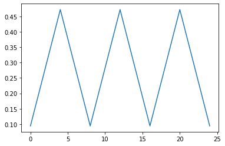
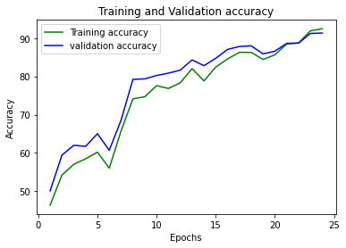
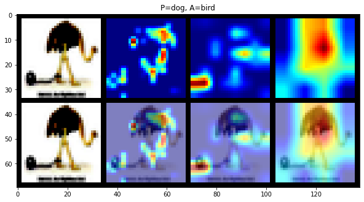

## CIFAR 10 dataset visualization using Resnet 18 CNN model , albumentation image augmentation , LR finder , 

### Authors

* **Deepak Hazarika** 
* **Parinita Bora**
* **Gurudatta**
* 
10/10/2020 9:40:54 PM 

----------

## Source code 

Source code for the above modules are in git package

1.  https://github.com/tfdeepnet/visionlib/tree/master/utils
2.  https://github.com/tfdeepnet/visionlib/tree/master/models

## LRfinder

LRfinder was used to find the learning rate of DavidResnet model under the following setup

    Batch size = 128
    Number of iteration = 5859

A plot of lr vs validation accuracy was done and the lr at the point where change in accuracy is the highest was picked as the optimum lr.

After finding the optimum LR , the above lr was used as a reference to run the DavidResnet under the following setup:

Carry out following transformation

1.  Padding of 4 on each side
2.  RandomCrop (32, 32) (after )
3.  HorizontalFlip
4.  CutOut(8, 8)

additional setup:

1.	Batch size = 512

## Target accuracy : 90%. 

## Triangular Cyclical learning rate

Image of triangular learning rate

## One Cycle learning rate

Image of one cycle learning rate

## DavidResnet model 

The model architecture along with receptive field at each layer is given  below for reference.

- Receptive field of last layer is 114
- Model has 6,713,674 parameters

|  Layer (type)           |  Output Shape        | Number of Parameters |  Receptive Field |  Jump in |
| ----------------------- | -------------------- | -------------------- | ---------------- | -------- |
|  Conv2d-1               |  \[-1, 64, 32, 32\]  | 1,728                | 3                | 1        |
|  BatchNorm2d-2          |  \[-1, 64, 32, 32\]  | 128                  | 0                | 0        |
|  Conv2d-3               |  \[-1, 128, 32, 32\] | 73,728               | 5                | 1        |
|  MaxPool2d-4            |  \[-1, 128, 16, 16\] | 0                    | 6                | 1        |
|  BatchNorm2d-5          |  \[-1, 128, 16, 16\] | 256                  | 0                | 0        |
|  Conv2d-6               |  \[-1, 128, 16, 16\] | 147,456              | 10               | 2        |
|  BatchNorm2d-7          |  \[-1, 128, 16, 16\] | 256                  | 0                | 0        |
|  Conv2d-8               |  \[-1, 128, 16, 16\] | 147,456              | 14               | 2        |
|  BatchNorm2d-9          |  \[-1, 128, 16, 16\] | 256                  | 0                | 0        |
|  Conv2d-10              |  \[-1, 128, 16, 16\] | 8,192                | 14               | 2        |
|  BatchNorm2d-11         |  \[-1, 128, 16, 16\] | 256                  | 0                | 0        |
|  BasicBlock-12          |  \[-1, 128, 16, 16\] | 0                    | 0                | 0        |
|  Conv2d-13              |  \[-1, 256, 16, 16\] | 294,912              | 22               | 4        |
|  MaxPool2d-14           |  \[-1, 256, 8, 8\]   | 0                    | 26               | 4        |
|  BatchNorm2d-15         |  \[-1, 256, 8, 8\]   | 512                  | 0                | 0        |
|  TransitionBlock-16     |  \[-1, 256, 8, 8\]   | 0                    | 0                | 0        |
|  Conv2d-17              |  \[-1, 512, 8, 8\]   | 1,179,648            | 42               | 8        |
|  MaxPool2d-18           |  \[-1, 512, 4, 4\]   | 0                    | 50               | 8        |
|  BatchNorm2d-19         |  \[-1, 512, 4, 4\]   | 1,024                | 0                | 0        |
|  Conv2d-20              |  \[-1, 512, 4, 4\]   | 2,359,296            | 82               | 16       |
|  BatchNorm2d-21         |  \[-1, 512, 4, 4\]   | 1,024                | 0                | 0        |
|  Conv2d-22              |  \[-1, 512, 4, 4\]   | 2,359,296            | 114              | 16       |
|  BatchNorm2d-23         |  \[-1, 512, 4, 4\]   | 1,024                | 0                | 0        |
|  Conv2d-24              |  \[-1, 512, 4, 4\]   | 131,072              | 114              | 16       |
|  BatchNorm2d-25         |  \[-1, 512, 4, 4\]   | 1,024                | 0                | 0        |
|  BasicBlock-26          |  \[-1, 512, 4, 4\]   | 0                    | 0                | 0        |
|  Linear-27              |  \[-1, 10\]          | 5,130                | 0                | 0        |
|  ResNet-28              |  \[-1, 10\]          | 0                    | 0                | 0        |
| Total params: 6,713,674 |                      |                      |                  |          |

## DavidResnet model performance

Training accuracy : **92.06%**

Test Accuracy : **91.31%**

## Class Accuracy

| Class                                | accuracy |
| ------------------------------------ | -------- |
| plane                                | 92%      |
|  car                                 | 97%      |
| bird                                 | 88%      |
|  cat                                 | 81%      |
| deer                                 | 91%      |
|  dog                                 | 84%      |
| frog                                 | 93%      |
| horse                                | 95%      |
| ship                                 | 95%      |
| truck                                | 93%      |
| the network on the 10000 test images | 91.31%   |

## Misclassified image

- Few images which were misclassified

## Grad cam of misclassified image

Grad cam of misclassified Dog image

Grad cam of misclassified Bird image

## Training log

  0%|          | 0/98 [00:00<?, ?it/s]

Epoch: 1 LR: 0.0944

Loss=1.1857134103775024 Batch_id=97 Accuracy=40.71: 100%|██████████| 98/98 [00:28<00:00,  3.47it/s]

Test set: Average loss: 0.0028, Accuracy: 5011/10000 (50.11%)

  0%|          | 0/98 [00:00<?, ?it/s]

Epoch: 2 LR: 0.16991999999999996

Loss=1.0478315353393555 Batch_id=97 Accuracy=52.24: 100%|██████████| 98/98 [00:26<00:00,  3.66it/s]

Test set: Average loss: 0.0025, Accuracy: 5941/10000 (59.41%)

  0%|          | 0/98 [00:00<?, ?it/s]

Epoch: 3 LR: 0.24544

Loss=1.0992376804351807 Batch_id=97 Accuracy=59.16: 100%|██████████| 98/98 [00:27<00:00,  3.59it/s]

Test set: Average loss: 0.0023, Accuracy: 6200/10000 (62.00%)

  0%|          | 0/98 [00:00<?, ?it/s]

Epoch: 4 LR: 0.32095999999999997

Loss=0.8629339337348938 Batch_id=97 Accuracy=65.40: 100%|██████████| 98/98 [00:27<00:00,  3.62it/s]

Test set: Average loss: 0.0028, Accuracy: 6172/10000 (61.72%)

  0%|          | 0/98 [00:00<?, ?it/s]

Epoch: 5 LR: 0.39648

Loss=0.8227150440216064 Batch_id=97 Accuracy=68.65: 100%|██████████| 98/98 [00:27<00:00,  3.60it/s]

Test set: Average loss: 0.0022, Accuracy: 6502/10000 (65.02%)

  0%|          | 0/98 [00:00<?, ?it/s]

Epoch: 6 LR: 0.472

Loss=0.690125584602356 Batch_id=97 Accuracy=72.30: 100%|██████████| 98/98 [00:27<00:00,  3.60it/s]

Test set: Average loss: 0.0030, Accuracy: 6070/10000 (60.70%)

  0%|          | 0/98 [00:00<?, ?it/s]

Epoch: 7 LR: 0.45311999999999997

Loss=0.6961143612861633 Batch_id=97 Accuracy=76.23: 100%|██████████| 98/98 [00:27<00:00,  3.59it/s]

Test set: Average loss: 0.0021, Accuracy: 6859/10000 (68.59%)

  0%|          | 0/98 [00:00<?, ?it/s]

Epoch: 8 LR: 0.43423999999999996

Loss=0.5811417698860168 Batch_id=97 Accuracy=78.74: 100%|██████████| 98/98 [00:27<00:00,  3.61it/s]

Test set: Average loss: 0.0013, Accuracy: 7921/10000 (79.21%)

  0%|          | 0/98 [00:00<?, ?it/s]

Epoch: 9 LR: 0.41535999999999995

Loss=0.5548186898231506 Batch_id=97 Accuracy=80.48: 100%|██████████| 98/98 [00:27<00:00,  3.60it/s]

Test set: Average loss: 0.0013, Accuracy: 7935/10000 (79.35%)

  0%|          | 0/98 [00:00<?, ?it/s]

Epoch: 10 LR: 0.39648

Loss=0.5084803700447083 Batch_id=97 Accuracy=81.93: 100%|██████████| 98/98 [00:27<00:00,  3.60it/s]

Test set: Average loss: 0.0012, Accuracy: 8022/10000 (80.22%)

  0%|          | 0/98 [00:00<?, ?it/s]

Epoch: 11 LR: 0.3776

Loss=0.4964086413383484 Batch_id=97 Accuracy=82.93: 100%|██████████| 98/98 [00:27<00:00,  3.61it/s]

Test set: Average loss: 0.0013, Accuracy: 8084/10000 (80.84%)

  0%|          | 0/98 [00:00<?, ?it/s]

Epoch: 12 LR: 0.35872

Loss=0.5680851340293884 Batch_id=97 Accuracy=83.73: 100%|██████████| 98/98 [00:27<00:00,  3.60it/s]

Test set: Average loss: 0.0012, Accuracy: 8162/10000 (81.62%)

  0%|          | 0/98 [00:00<?, ?it/s]

Epoch: 13 LR: 0.33984

Loss=0.41301241517066956 Batch_id=97 Accuracy=85.16: 100%|██████████| 98/98 [00:27<00:00,  3.61it/s]

Test set: Average loss: 0.0009, Accuracy: 8429/10000 (84.29%)

  0%|          | 0/98 [00:00<?, ?it/s]

Epoch: 14 LR: 0.32095999999999997

Loss=0.383761465549469 Batch_id=97 Accuracy=85.52: 100%|██████████| 98/98 [00:27<00:00,  3.58it/s]

Test set: Average loss: 0.0011, Accuracy: 8279/10000 (82.79%)

  0%|          | 0/98 [00:00<?, ?it/s]

Epoch: 15 LR: 0.30208

Loss=0.32255882024765015 Batch_id=97 Accuracy=86.69: 100%|██████████| 98/98 [00:27<00:00,  3.60it/s]

Test set: Average loss: 0.0010, Accuracy: 8472/10000 (84.72%)

  0%|          | 0/98 [00:00<?, ?it/s]

Epoch: 16 LR: 0.2832

Loss=0.4494434595108032 Batch_id=97 Accuracy=87.03: 100%|██████████| 98/98 [00:27<00:00,  3.61it/s]

Test set: Average loss: 0.0008, Accuracy: 8704/10000 (87.04%)

  0%|          | 0/98 [00:00<?, ?it/s]

Epoch: 17 LR: 0.26432

Loss=0.2864599823951721 Batch_id=97 Accuracy=87.79: 100%|██████████| 98/98 [00:27<00:00,  3.60it/s]

Test set: Average loss: 0.0008, Accuracy: 8780/10000 (87.80%)

  0%|          | 0/98 [00:00<?, ?it/s]

Epoch: 18 LR: 0.24544

Loss=0.4143424332141876 Batch_id=97 Accuracy=88.36: 100%|██████████| 98/98 [00:27<00:00,  3.60it/s]

Test set: Average loss: 0.0008, Accuracy: 8798/10000 (87.98%)

  0%|          | 0/98 [00:00<?, ?it/s]

Epoch: 19 LR: 0.22655999999999998

Loss=0.25640782713890076 Batch_id=97 Accuracy=89.09: 100%|██████████| 98/98 [00:27<00:00,  3.61it/s]

Test set: Average loss: 0.0009, Accuracy: 8587/10000 (85.87%)

  0%|          | 0/98 [00:00<?, ?it/s]

Epoch: 20 LR: 0.20768000000000003

Loss=0.3189050257205963 Batch_id=97 Accuracy=89.65: 100%|██████████| 98/98 [00:27<00:00,  3.60it/s]

Test set: Average loss: 0.0009, Accuracy: 8658/10000 (86.58%)

  0%|          | 0/98 [00:00<?, ?it/s]

Epoch: 21 LR: 0.1888

Loss=0.2193135768175125 Batch_id=97 Accuracy=90.03: 100%|██████████| 98/98 [00:27<00:00,  3.60it/s]

Test set: Average loss: 0.0007, Accuracy: 8862/10000 (88.62%)

  0%|          | 0/98 [00:00<?, ?it/s]

Epoch: 22 LR: 0.16991999999999996

Loss=0.30214211344718933 Batch_id=97 Accuracy=90.46: 100%|██████████| 98/98 [00:27<00:00,  3.60it/s]

Test set: Average loss: 0.0007, Accuracy: 8869/10000 (88.69%)

  0%|          | 0/98 [00:00<?, ?it/s]

Epoch: 23 LR: 0.04248000000000001

Loss=0.2326720952987671 Batch_id=97 Accuracy=91.83: 100%|██████████| 98/98 [00:27<00:00,  3.60it/s]

Test set: Average loss: 0.0006, Accuracy: 9121/10000 (91.21%)

  0%|          | 0/98 [00:00<?, ?it/s]

Epoch: 24 LR: 0.028319999999999994

Loss=0.2616382837295532 Batch_id=97 Accuracy=92.06: 100%|██████████| 98/98 [00:27<00:00,  3.60it/s]

Test set: Average loss: 0.0005, Accuracy: 9131/10000 (91.31%)

Finished Training

