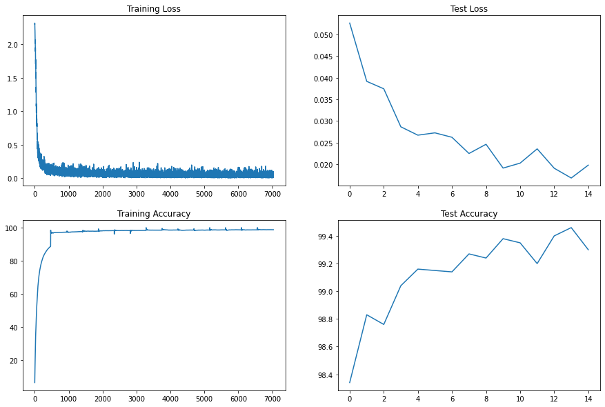

# MNIST digit recognizer - getting an accuracy of 99.4%

### Authors

* **Deepak Hazarika** 
* **Parinita Bora**
* **Gurudatta**

8/22/2020 4:06:36 PM 

----------

The aim of this project is to achieve a validation accuracy of >= 99.4% under the following constraint:

1. 99.4% validation accuracy (this must be consistently shown in last few epochs, and not a one-time achievement) 

2. Less than or equal to 15 Epochs

3. Less than 8000 Parameters

The project is executed in 4 phases

## Phase 1 - Build a baseline model

Target:

    Build a baseline model which meets criterion 3
    Basic Transform 
		- convert to tensor
		- normalize the data - 
			- mean = 0.1307, 
			- std. deviation = 0.3081
    Use the base code shared by Rohan 

Model design

| Layer name  | Kernel size | Padding | Stride | Image size out | Receptive field out | Parameters calculation | Parameters |
|-------------|-------------|---------|--------|----------------|---------------------|------------------------|------------|
|  Conv2d-1   | 3           | 0       | 1      | 26             | 3                   | 3x3x1x10 + 10          | 100        |
| Conv2d-2    | 3           | 0       | 1      | 24             | 5                   | 3x3x10x10 + 10         | 910        |
|  Conv2d-3   | 3           | 0       | 1      | 22             | 7                   | 3x3x10x10 + 10         | 910        |
| MaxPool2d-3 | 2           | 0       | 2      | 11             | 8                   |                        | 0          |
| Conv2d-5    | 3           | 0       | 1      | 9              | 12                  | 3x3x10x10 + 10         | 910        |
|  Conv2d-7   | 3           | 0       | 1      | 7              | 16                  | 3x3x10x11 + 11         | 1001       |
| Conv2d-8    | 3           | 0       | 1      | 5              | 20                  | 3x3x11x12 + 12         | 1200       |
| Conv2d-9    | 3           | 0       | 1      | 3              | 24                  | 3x3x12x12 + 12         | 1308       |
| Conv2d-9    | 3           | 0       | 1      | 1              | 28                  | 3x3x12x13 + 13         | 1417       |
| Conv2d-10   | 1           | 0       | 1      | 1              | 28                  | 1x1x13x10+10           | 140        |
|             |             |         |        |                |                     | Total parameters       | 7896       |
    
Results:

        Parameters: 7896
        Best Training Accuracy: 99.04
        Best Test Accuracy: 98.88
    
Analysis:

        A light model with 1 max pool layer and 7 3x3 conv2d layer and 1 1x1 conv2d layer.The last layer is used to downsample to 10 features, which is equal to the number of unique digits. 
        Model is convolving using 3x3 kernel and trying to extract features with minimum number of parameters.
        It is able to predict a proper digit , but if there is variation in terms of rotation of image etc , it fails to predict the digit correctly.Thus the validation accuracy is 98.88 

  
## Phase 2 - Include batch normalization

Target:

    Include batch normalization 
    
Model design

| Layer name  | Kernel size | Padding | Stride | Image size out | Receptive field out | Parameters calculation | Parameters |
|-------------|-------------|---------|--------|----------------|---------------------|------------------------|------------|
|  Conv2d-1   | 3           | 0       | 1      | 26             | 3                   | 3x3x1x10               | 90         |
| Batchnorm   |             |         |        |                |                     |                        | 20         |
| Conv2d-2    | 3           | 0       | 1      | 24             | 5                   | 3x3x10x10               | 900        |
| Batchnorm   |             |         |        |                |                     |                        | 20         |
|  Conv2d-3   | 3           | 0       | 1      | 22             | 7                   | 3x3x10x10               | 900        |
| Batchnorm   |             |         |        |                |                     |                        | 20         |
| MaxPool2d-3 | 2           | 0       | 2      | 11             | 8                   |                        | 0          |
| Conv2d-5    | 3           | 0       | 1      | 9              | 12                  | 3x3x10x10               | 900        |
| Batchnorm   |             |         |        |                |                     |                        | 20         |
|  Conv2d-7   | 3           | 0       | 1      | 7              | 16                  | 3x3x10x11              | 990        |
| Batchnorm   |             |         |        |                |                     |                        | 22         |
| Conv2d-8    | 3           | 0       | 1      | 5              | 20                  | 3x3x11x12              | 1188       |
| Batchnorm   |             |         |        |                |                     |                        | 24         |
| Conv2d-9    | 3           | 0       | 1      | 3              | 24                  | 3x3x12x12              | 1296       |
| Batchnorm   |             |         |        |                |                     |                        | 24         |
| Conv2d-9    | 3           | 0       | 1      | 1              | 28                  | 3x3x12x13              | 1404       |
| Batchnorm   |             |         |        |                |                     |                        | 26         |
| Conv2d-10   | 1           | 0       | 1      | 1              | 28                  | 1x1x13x10              | 130        |
|             |             |         |        |                |                     | Total parameters       | 7974       |

Results:

        Parameters: 7974
        Best Training Accuracy: 98.88
        Best Test Accuracy: 99.04
    
Analysis:

        By adding a batch normalization layer , it reduces the variability in the input, to a layer.

		How it works?
  
			- Take the batch mean
			- Take the batch standard deviation.
			- normalize the input using the mean and standard deviation calculated above.

			- scale the normalized input by gamma and shift by adding a randomly initialized parameter beta.

		So batch normalization lets SGD do the denormalization by changing onle these 2 trainable parameter -beta and gamma , instead of losing the stability of the network by changing all the weights.The formula is shown in the image below.
		

		Batch normalization reduces overfitting because it has a slight regularization effect.So we find validation accuracy has improved to 99.04% , whereas train accuracy is underfitting at 98.88%

## Phase 3 - Include Average Pooling and Image Augmentation

Target:

    Include Average pooling , Image augmentation and a higher learning rate
     

Model design

| Layer name  | Kernel size | Padding | Stride | Image size out | Receptive field out | Parameters calculation | Parameters |
|-------------|-------------|---------|--------|----------------|---------------------|------------------------|------------|
|  Conv2d-1   | 3           | 0       | 1      | 26             | 3                   | 3x3x1x9                | 81         |
| Batchnorm   |             |         |        |                |                     | 2x9                    | 18         |
| Conv2d-2    | 3           | 0       | 1      | 24             | 5                   | 3x3x9x9                | 729        |
| Batchnorm   |             |         |        |                |                     | 2x9                    | 18         |
|  Conv2d-3   | 3           | 0       | 1      | 22             | 7                   | 3x3x9x9                | 729        |
| Batchnorm   |             |         |        |                |                     | 2x9                    | 18         |
| MaxPool2d-1 | 2           | 0       | 2      | 11             | 8                   |                        |            |
| Conv2d-4    | 3           | 0       | 1      | 9              | 12                  | 3x3x9x16               | 1296       |
| Batchnorm   |             |         |        |                |                     | 2x16                   | 32         |
|  Conv2d-5   | 3           | 0       | 1      | 7              | 16                  | 3x3x16x16              | 2304       |
| Batchnorm   |             |         |        |                |                     | 2x16                   | 32         |
| Conv2d-6    | 3           | 0       | 1      | 5              | 20                  | 3x3x16x16              | 2304       |
| Batchnorm   |             |         |        |                |                     | 2x16                   | 32         |
| Conv2d-7    | 1           | 0       | 1      | 5              | 20                  | 1x1x16x10              | 160        |
| AvgPool 1   | 5           | 0       | 1      | 1              | 28                  |                        |            |
|             |             |         |        |                |                     | Total Parameters       | 7753       |
Results:

        Parameters: 7753
        Best Training Accuracy: 98.72
        Best Test Accuracy: 99.30
    
Analysis:

        We can use a higher learning rate becasue batch normalization ensures no activation goes very high or very low.

		With image augmentation, noise is introduced in the image by using techniques like 
			RandomAffine
			ColorJitter
		The model become more robust by training harder and hence we see the train accuracy is underfitting.But the validation accuracy is higher when tested on actual data.

		Replacing the last 2 3x3 convolution layer has also helped increase  the capacity of the network by increasing the channels to 16 in 3 convolution layers after max pooling.
 
### What needs to be fixed is the spike in the validation accuracy towards the end of the run.

        

## Phase 4 - Include LR scheduler

Target:

    Include LR scheduler
    

Model design

| Layer name  | Kernel size | Padding | Stride | Image size out | Receptive field out | Parameters calculation | Parameters |
|-------------|-------------|---------|--------|----------------|---------------------|------------------------|------------|
|  Conv2d-1   | 3           | 0       | 1      | 26             | 3                   | 3x3x1x9                | 81         |
| Batchnorm   |             |         |        |                |                     | 2x9                    | 18         |
| Conv2d-2    | 3           | 0       | 1      | 24             | 5                   | 3x3x9x9                | 729        |
| Batchnorm   |             |         |        |                |                     | 2x9                    | 18         |
|  Conv2d-3   | 3           | 0       | 1      | 22             | 7                   | 3x3x9x9                | 729        |
| Batchnorm   |             |         |        |                |                     | 2x9                    | 18         |
| MaxPool2d-1 | 2           | 0       | 2      | 11             | 8                   |                        |            |
| Conv2d-4    | 3           | 0       | 1      | 9              | 12                  | 3x3x9x16               | 1296       |
| Batchnorm   |             |         |        |                |                     | 2x16                   | 32         |
|  Conv2d-5   | 3           | 0       | 1      | 7              | 16                  | 3x3x16x16              | 2304       |
| Batchnorm   |             |         |        |                |                     | 2x16                   | 32         |
| Conv2d-6    | 3           | 0       | 1      | 5              | 20                  | 3x3x16x16              | 2304       |
| Batchnorm   |             |         |        |                |                     | 2x16                   | 32         |
| Conv2d-7    | 1           | 0       | 1      | 5              | 20                  | 1x1x16x10              | 160        |
| AvgPool 1   | 5           | 0       | 1      | 1              | 28                  |                        |            |
|             |             |         |        |                |                     | Total Parameters       | 7753       |

Results:

        Parameters: 7753
        Best Training Accuracy: 98.75
        Best Test Accuracy: 99.47
    
Analysis:

        As we saw in phase 3 above, a higher learning rate makes the  model erratic.It may or may not hit global minimum always.So a mechanism which incrementally reduces the learning rate as the model learns is an ideal solution.A Decaying learning rate image illustrating the point is given below.

		The model is kept same as in phase 3.

## In phase 4 ,target validation accuracy of >= 99.4 is achieved consistently towards the end of the run.

