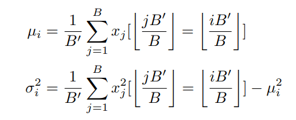
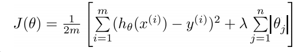
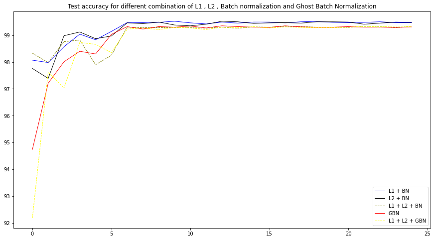
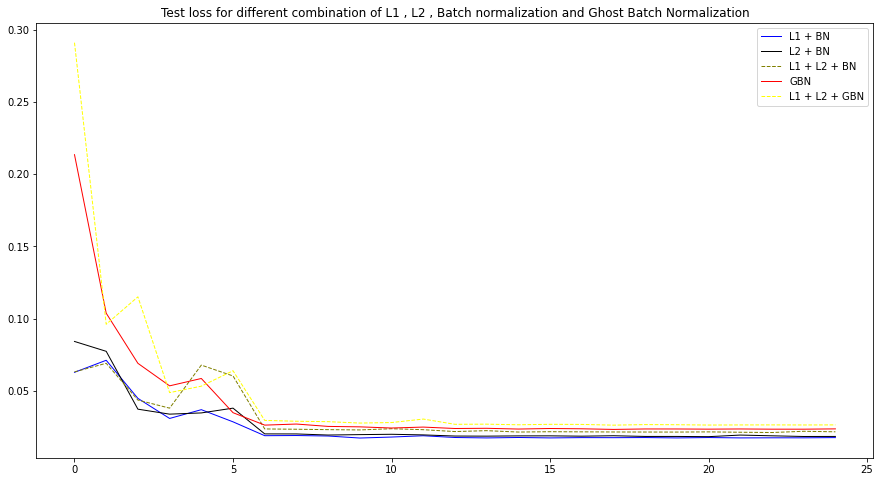
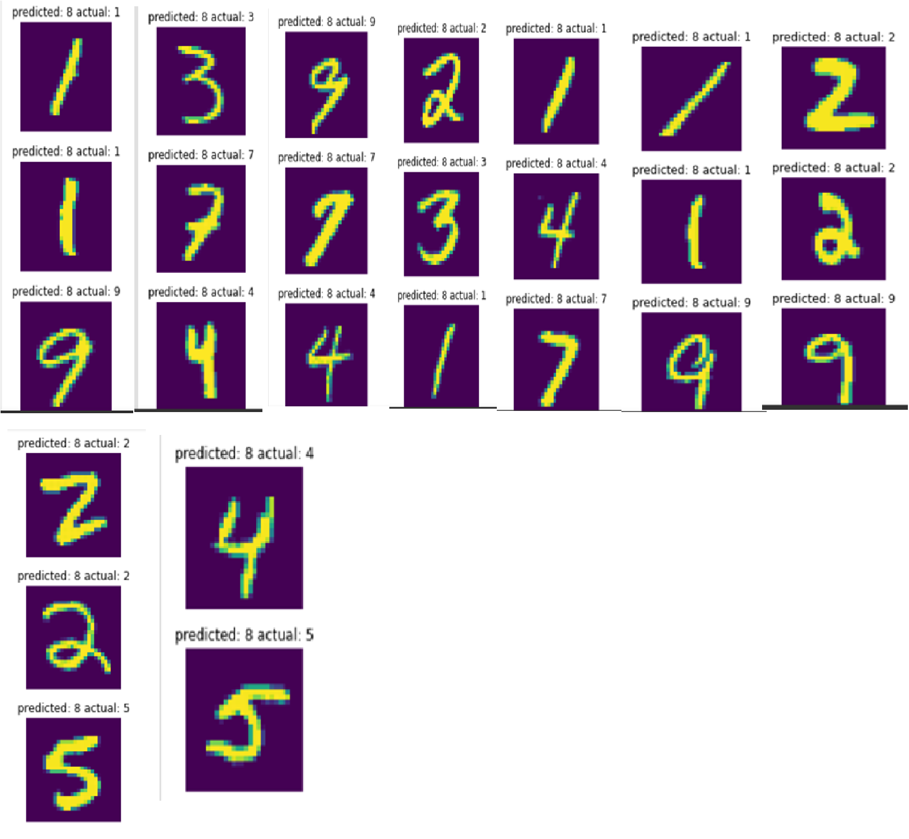

# MNIST digit recognizer - effect of regularization on model performance

### Authors

* **Deepak Hazarika** 
* **Parinita Bora**
* **Gurudatta**

8/22/2020 4:06:36 PM 

----------

Using model 4 from previous week.This model has the following highlights.

		99.4% validation accuracy (this must be consistently shown in last few epochs, and not a one-time achievement) 

		Less than or equal to 15 Epochs

		Less than 8000 Parameters

Run the baseline model for 25 epochs with the following regularization combinations:

    1- with L1 + Batch Normalization
    2- with L2 + Batch Normalization
    3- with L1 and L2 with Batch Normalization
    4- with Ghost Batch Normalization
    5- with L1 and L2 with Ghost Batch Normalization

and report findings:

## Baseline model structure 

Model design

| Layer name  | Kernel size | Padding | Stride | Image size out | Receptive field out | Parameters calculation | Parameters |
|-------------|-------------|---------|--------|----------------|---------------------|------------------------|------------|
|  Conv2d-1   | 3           | 0       | 1      | 26             | 3                   | 3x3x1x8                | 72         |
| Batchnorm   |             |         |        |                |                     | 2x8                    | 16         |
| Conv2d-2    | 3           | 0       | 1      | 24             | 5                   | 3x3x8x8                | 576        |
| Batchnorm   |             |         |        |                |                     | 2x8                    | 16         |
|  Conv2d-3   | 3           | 0       | 1      | 22             | 7                   | 3x3x8x8                | 576        |
| Batchnorm   |             |         |        |                |                     | 2x8                    | 16         |
| MaxPool2d-1 | 2           | 0       | 2      | 11             | 8                   |                        |            |
| Conv2d-4    | 3           | 0       | 1      | 9              | 12                  | 3x3x8x16               | 1152       |
| Batchnorm   |             |         |        |                |                     | 2x16                   | 32         |
|  Conv2d-5   | 3           | 0       | 1      | 7              | 16                  | 3x3x16x16              | 2304       |
| Batchnorm   |             |         |        |                |                     | 2x16                   | 32         |
| Conv2d-6    | 3           | 0       | 1      | 5              | 20                  | 3x3x16x16              | 2304       |
| Batchnorm   |             |         |        |                |                     | 2x16                   | 32         |
| Conv2d-7    | 1           | 0       | 1      | 5              | 20                  | 1x1x16x10              | 160        |
| AvgPool 1   | 5           | 0       | 1      | 1              | 28                  |                        |            |
|             |             |         |        |                |                     | Total Parameters       | 7288       |

        Model Parameters: 7288

## Code walkthrough

### What is Ghost Batch Normalization (reference 2)

Ghost Batch Normalization, a technique originally developed for training with very large batch sizes
across many accelerators (Hoffer et al., 2017), consists of calculating normalization statistics on disjoint
subsets of each training batch. Concretely, with an overall batch size of B and a “ghost” batch
size of B0 such that B0 evenly divides B, the normalization statistics for example i are calculated as

Why might Ghost Batch Normalization be useful? One reason is its power as a regularizer: due to
the stochasticity in normalization statistics caused by the random selection of minibatches during
training, Batch Normalization causes the representation of a training example to randomly change
every time it appears in a different batch of data. Ghost Batch Normalization, by decreasing the
number of examples that the normalization statistics are calculated over, increases the strength of this
stochasticity, thereby increasing the amount of regularization. Based on this hypothesis, we would
expect to see a unimodal effect of the Ghost Batch Normalization size B0 on model performance—
a large value of B0 would offer somewhat diminished performance as a weaker regularizer, a very
low value of B0 would have excess regularization and lead to poor performance, and an intermediate
value would offer the best tradeoff of regularization strength.

### Few things to take care of 

	Run the model in a loop for 5 iteration , at the end of each loop clear the cache.

	create 2 model - one with Batch normalization , another with Ghost Batch normalization

	In each loop make provision to switch on/off L1 and L2 regularization.

	In 4th and 5th loop load the train and test data each time 

	 
### Intuition of L1 regularization 

	Weights for different potential training sets will be more similar — which means that the model variance is reduced (in contrast, if we shifted our weights randomly each time just to move away from the overfitted solution, the variance would not change). (reference 3)

	We will have a smaller weight for each feature (and/or less features if using L1 reg.). Why does this decrease overfitting? The way I find it easy to think about is that in a typical case we will have a small number of simple features that will explain most of the variance (e.g. most of y will be explained by y_hat = ax+b); but if our model is not regularized, we can add as many more features we want that explain the residual variance of the dataset (e.g. y_at = ax + bx² +cx³ + dx⁴ + e), which would naturally overfit the trainin set. Inroducing a penalty to the sum of the weights means that the model has to “distribute” its weights optimally, so naturally most of this “resource” will go to the simple features that explain most of the variance, with complex features getting small or zero weights.(reference 3)

Features of L1 regularization:

	L1 penalizes the sum of the absolute value of weights.

	L1 has a sparse solution

	L1 generates a model that is simple and interpretable but cannot learn complex patterns

	L1 is robust to outliers

## Findings from the run

### Hyperparameters

	BATCH_SIZE = 128 for run 1,2,3
	BATCH_SIZE = 128 for run 4,5 
	LR = 0.022
	LAMBDA_L1 = 0.0001
	GBN_NUM_SPLITS = 2
	NUM_WORKERS = 4 
	LAMBDA_L1 = 0.0001
	WEIGHT_DCY = 0.001

 
### Test Accuracy - comment on L1 and L2 regularization

In a run of 25 epochs , there are 2 groups visible from the graph

Group 1

	with L1 , L2 and Batch Normalization
    with Ghost Batch Normalization
    with L1 and L2 with Ghost Batch Normalization

Group 2

	with L1 + Batch Normalization
    with L2 + Batch Normalization

Group 2 accuracy is consistently above group 2	, this is contrary to the belief that Ghost Batch normalization has a regularization effect and helps to improve performance.In this case it could be because of the selected batch size = 256 and number of splits = 2.This is not the optimal setting, further investigation will be required to get the optimal combination.

L1 and L2 regularization when applied separately has similar result , but the combined effect of L1 and L2 is worse than stand alone usage.

### Test losses

Test loss follows an inverse pattern of test accuracy , Group 1 mentioned above has consistently higher loss compared to group 1 .In this investigation model with L1 and Batchnormalization outperforms all other combinations.

### Misclassified image

Misclassified images of 26 digits is shown below.

## Effect of regularization

	When the above performance is compared with the baseline model , there is no improvement.

	L1 and L2 when applied along with Batch normalization shows similar performance to baseline model.

	More investigation is required to find better performance with ghost batch normalization, in this setup , it performed worse than baseline model.

 

reference:
1- https://github.com/davidcpage/cifar10-fast/blob/master/bag_of_tricks.ipynb (This code is for ghost batch normalization)
2- FOUR THINGS EVERYONE SHOULD KNOW TO IMPROVE BATCH NORMALIZATION paper published by Cecilia Summers and Michael J. Dinneen
3- https://medium.com/@edden.gerber/thanks-for-the-article-1003ad7478b2
 
