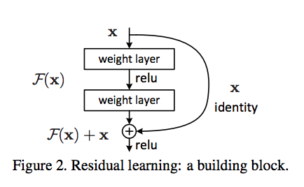

## CIFAR 10 dataset visualization using Resnet 56 CNN model

### Authors

* **Deepak Hazarika** 
* **Parinita Bora**
* **Gurudatta**

9/11/2020 4:44:29 AM  

----------

## Resnet design philosophy

Residual Networks, or ResNets, learn residual functions with reference to the layer inputs, instead of learning unreferenced functions. Instead of hoping each few stacked layers directly fit a desired underlying mapping, residual nets let these layers fit a residual mapping. They stack residual blocks ontop of each other to form network: e.g. a ResNet-50 has fifty layers using these blocks.

Formally, denoting the desired underlying mapping as 

, we let the stacked nonlinear layers fit another mapping of  $\mathcal{F}(x):=\mathcal{H}(x)-x$ . The original mapping is recast into $\mathcal{F}(x)+x$

There is empirical evidence that these types of network are easier to optimize, and can gain accuracy from considerably increased depth.

## Receptive field calculation of Resnet 56 CNN model

| Layer   name    | Kernel size | Padding | Stride | Image size in | Jump in | Jump out | Image size out | Receptive field   in  | Receptive field   out | in channel |    out channel   | Num Parameters |
|-----------------|:-----------:|:-------:|:------:|:-------------:|:-------:|:--------:|:--------------:|:---------------------:|:---------------------:|:----------:|:----------------:|:--------------:|
| Conv2d-1        |      3      |    1    |    1   |       32      |    1    |     1    |       32       |           1           |           3           |      3     |        16        | 432            |
| BatchNorm2d-2   |             |         |        |               |         |          |                |                       |                       |     16     |        16        |       32       |
| Conv2d-3        |      3      |    1    |    1   |       32      |    1    |     1    |       32       |           3           |           5           |     16     |        16        | 2304           |
| BatchNorm2d-4   | 1           | 0       | 1      |       32      |    1    |     1    |       32       |           5           |           5           |     16     |        16        |       32       |
| Conv2d-5        |      3      |    1    |    1   |       32      |    1    |     1    |       32       |           5           |           7           |     16     |        16        | 2304           |
| BatchNorm2d-6   |             |         |        |               |         |          |                |                       |                       |     16     |        16        |       32       |
| Conv2d-8        |      3      |    1    |    1   |       32      |    1    |     1    |       32       |           7           |           9           |     16     |        16        | 2304           |
| BatchNorm2d-9   |             |         |        |               |         |          |                |                       |                       |     16     |        16        |       32       |
| Conv2d-10       |      3      |    1    |    1   |       32      |    1    |     1    |       32       |           9           |           11          |     16     |        16        | 2304           |
| BatchNorm2d-11  |             |         |        |               |         |          |                |                       |                       |     16     |        16        |       32       |
| Conv2d-13       |      3      |    1    |    1   |       32      |    1    |     1    |       32       |           11          |           13          |     16     |        16        | 2304           |
| BatchNorm2d-14  |             |         |        |               |         |          |                |                       |                       |     16     |        16        |       32       |
| Conv2d-15       |      3      |    1    |    1   |       32      |    1    |     1    |       32       |           13          |           15          |     16     |        16        | 2304           |
| BatchNorm2d-16  |             |         |        |               |         |          |                |                       |                       |     16     |        16        |       32       |
| Conv2d-18       |      3      |    1    |    1   |       32      |    1    |     1    |       32       |           15          |           17          |     16     |        16        | 2304           |
| BatchNorm2d-19  |             |         |        |               |         |          |                |                       |                       |     16     |        16        |       32       |
| Conv2d-20       |      3      |    1    |    1   |       32      |    1    |     1    |       32       |           17          |           19          |     16     |        16        | 2304           |
| BatchNorm2d-21  |             |         |        |               |         |          |                |                       |                       |     16     |        16        |       32       |
| Conv2d-23       |      3      |    1    |    1   |       32      |    1    |     1    |       32       |           19          |           21          |     16     |        16        | 2304           |
| BatchNorm2d-24  |             |         |        |               |         |          |                |                       |                       |     16     |        16        |       32       |
| Conv2d-25       |      3      |    1    |    1   |       32      |    1    |     1    |       32       |           21          |           23          |     16     |        16        | 2304           |
| BatchNorm2d-26  |             |         |        |               |         |          |                |                       |                       |     16     |        16        |       32       |
| Conv2d-28       |      3      |    1    |    1   |       32      |    1    |     1    |       32       |           23          |           25          |     16     |        16        | 2304           |
| BatchNorm2d-29  |             |         |        |               |         |          |                |                       |                       |     16     |        16        |       32       |
| Conv2d-30       |      3      |    1    |    1   |       32      |    1    |     1    |       32       |           25          |           27          |     16     |        16        | 2304           |
| BatchNorm2d-31  |             |         |        |               |         |          |                |                       |                       |     16     |        16        |       32       |
| Conv2d-33       |      3      |    1    |    1   |       32      |    1    |     1    |       32       |           27          |           29          |     16     |        16        | 2304           |
| BatchNorm2d-34  |             |         |        |               |         |          |                |                       |                       |     16     |        16        |       32       |
| Conv2d-35       |      3      |    1    |    1   |       32      |    1    |     1    |       32       |           29          |           31          |     16     |        16        | 2304           |
| BatchNorm2d-36  |             |         |        |               |         |          |                |                       |                       |     16     |        16        |       32       |
| Conv2d-38       |      3      |    1    |    1   |       32      |    1    |     1    |       32       |           31          |           33          |     16     |        16        | 2304           |
| BatchNorm2d-39  |             |         |        |               |         |          |                |                       |                       |     16     |        16        |       32       |
| Conv2d-40       |      3      |    1    |    1   |       32      |    1    |     1    |       32       |           33          |           35          |     16     |        16        | 2304           |
| BatchNorm2d-41  |             |         |        |               |         |          |                |                       |                       |     16     |        16        |       32       |
| Conv2d-43       |      3      |    1    |    1   |       32      |    1    |     1    |       32       |           35          |           37          |     16     |        16        | 2304           |
| BatchNorm2d-44  |             |         |        |               |         |          |                |                       |                       |     16     |        16        |       32       |
| Conv2d-45       |      3      |    1    |    1   |       32      |    1    |     1    |       32       |           37          |           39          |     16     |        16        | 2304           |
| BatchNorm2d-46  |             |         |        |               |         |          |                |                       |                       |     16     |        16        |       32       |
| Conv2d-48       |      3      |    1    |    2   |       32      |    1    |     2    |       16       |           39          |           41          |     16     |        16        | 144            |
| Conv2d-49       | 1           | 0       | 1      |       16      |    2    |     2    |       16       |           41          |           41          |     16     |        32        | 512            |
| BatchNorm2d-50  |             |         |        |               |         |          |                |                       |                       |     32     |        32        |       64       |
| Conv2d-51       |      3      |    1    |    1   |       16      |    2    |     2    |       16       |           41          |           45          |     32     |        32        | 9216           |
| BatchNorm2d-52  |             |         |        |               |         |          |                |                       |                       |     32     |        32        |       64       |
| LambdaLayer-53  |             |         |        |               |         |          |                |                       |                       |     32     |        32        |                |
| Conv2d-55       |      3      |    1    |    1   |       16      |    2    |     2    |       16       |           45          |           49          |     32     |        32        | 9216           |
| BatchNorm2d-56  |             |         |        |               |         |          |                |                       |                       |     32     |        32        |       64       |
| Conv2d-57       |      3      |    1    |    1   |       16      |    2    |     2    |       16       |           49          |           53          |     32     |        32        | 9216           |
| BatchNorm2d-58  |             |         |        |               |         |          |                |                       |                       |     32     |        32        |       64       |
| Conv2d-60       |      3      |    1    |    1   |       16      |    2    |     2    |       16       |           53          |           57          |     32     |        32        | 9216           |
| BatchNorm2d-61  |             |         |        |               |         |          |                |                       |                       |     32     |        32        |       64       |
| Conv2d-62       |      3      |    1    |    1   |       16      |    2    |     2    |       16       |           57          |           61          |     32     |        32        | 9216           |
| BatchNorm2d-63  |             |         |        |               |         |          |                |                       |                       |     32     |        32        |       64       |
| Conv2d-65       |      3      |    1    |    1   |       16      |    2    |     2    |       16       |           61          |           65          |     32     |        32        | 9216           |
| BatchNorm2d-66  |             |         |        |               |         |          |                |                       |                       |     32     |        32        |       64       |
| Conv2d-67       |      3      |    1    |    1   |       16      |    2    |     2    |       16       |           65          |           69          |     32     |        32        | 9216           |
| BatchNorm2d-68  |             |         |        |               |         |          |                |                       |                       |     32     |        32        |       64       |
| Conv2d-70       |      3      |    1    |    1   |       16      |    2    |     2    |       16       |           69          |           73          |     32     |        32        | 9216           |
| BatchNorm2d-71  |             |         |        |               |         |          |                |                       |                       |     32     |        32        |       64       |
| Conv2d-72       |      3      |    1    |    1   |       16      |    2    |     2    |       16       |           73          |           77          |     32     |        32        | 9216           |
| BatchNorm2d-73  |             |         |        |               |         |          |                |                       |                       |     32     |        32        |       64       |
| Conv2d-75       |      3      |    1    |    1   |       16      |    2    |     2    |       16       |           77          |           81          |     32     |        32        | 9216           |
| BatchNorm2d-76  |             |         |        |               |         |          |                |                       |                       |     32     |        32        |       64       |
| Conv2d-77       |      3      |    1    |    1   |       16      |    2    |     2    |       16       |           81          |           85          |     32     |        32        | 9216           |
| BatchNorm2d-78  |             |         |        |               |         |          |                |                       |                       |     32     |        32        |       64       |
| Conv2d-80       |      3      |    1    |    1   |       16      |    2    |     2    |       16       |           85          |           89          |     32     |        32        | 9216           |
| BatchNorm2d-81  |             |         |        |               |         |          |                |                       |                       |     32     |        32        |       64       |
| Conv2d-82       |      3      |    1    |    1   |       16      |    2    |     2    |       16       |           89          |           93          |     32     |        32        | 9216           |
| BatchNorm2d-83  |             |         |        |               |         |          |                |                       |                       |     32     |        32        |       64       |
| Conv2d-85       |      3      |    1    |    1   |       16      |    2    |     2    |       16       |           93          |           97          |     32     |        32        | 9216           |
| BatchNorm2d-86  |             |         |        |               |         |          |                |                       |                       |     32     |        32        |       64       |
| Conv2d-87       |      3      |    1    |    1   |       16      |    2    |     2    |       16       |           97          |          101          |     32     |        32        | 9216           |
| BatchNorm2d-88  |             |         |        |               |         |          |                |                       |                       |     32     |        32        |       64       |
| Conv2d-90       |      3      |    1    |    1   |       16      |    2    |     2    |       16       |          101          |          105          |     32     |        32        | 9216           |
| BatchNorm2d-91  |             |         |        |               |         |          |                |                       |                       |     32     |        32        |       64       |
| Conv2d-92       |      3      |    1    |    1   |       16      |    2    |     2    |       16       |          105          |          109          |     32     |        32        | 9216           |
| BatchNorm2d-93  |             |         |        |               |         |          |                |                       |                       |     32     |        32        |       64       |
| Conv2d-95       |      3      |    1    |    2   |       16      |    2    |     4    |        8       |          109          |          113          |     32     |        32        | 288            |
| Conv2d-96       | 1           | 0       | 1      |       8       |    4    |     4    |        8       |          113          |          113          |     32     |        64        | 2048           |
| BatchNorm2d-97  |             |         |        |               |         |          |                |                       |                       |     64     |        64        |       128      |
| Conv2d-98       |      3      |    1    |    1   |       8       |    4    |     4    |        8       |          113          |          121          |     64     |        64        | 36864          |
| BatchNorm2d-99  |             |         |        |               |         |          |                |                       |                       |     64     |        64        |       128      |
| LambdaLayer-100 |             |         |        |               |         |          |                |                       |                       |     64     |        64        |                |
| Conv2d-102      |      3      |    1    |    1   |       8       |    4    |     4    |        8       |          121          |          129          |     64     |        64        | 36864          |
| BatchNorm2d-103 |             |         |        |               |         |          |                |                       |                       |     64     |        64        |       128      |
| Conv2d-104      |      3      |    1    |    1   |       8       |    4    |     4    |        8       |          129          |          137          |     64     |        64        | 36864          |
| BatchNorm2d-105 |             |         |        |               |         |          |                |                       |                       |     64     |        64        |       128      |
| Conv2d-107      |      3      |    1    |    1   |       8       |    4    |     4    |        8       |          137          |          145          |     64     |        64        | 36864          |
| BatchNorm2d-108 |             |         |        |               |         |          |                |                       |                       |     64     |        64        |       128      |
| Conv2d-109      |      3      |    1    |    1   |       8       |    4    |     4    |        8       |          145          |          153          |     64     |        64        | 36864          |
| BatchNorm2d-110 |             |         |        |               |         |          |                |                       |                       |     64     |        64        |       128      |
| Conv2d-112      |      3      |    1    |    1   |       8       |    4    |     4    |        8       |          153          |          161          |     64     |        64        | 36864          |
| BatchNorm2d-113 |             |         |        |               |         |          |                |                       |                       |     64     |        64        |       128      |
| Conv2d-114      |      3      |    1    |    1   |       8       |    4    |     4    |        8       |          161          |          169          |     64     |        64        | 36864          |
| BatchNorm2d-115 |             |         |        |               |         |          |                |                       |                       |     64     |        64        |       128      |
| Conv2d-117      |      3      |    1    |    1   |       8       |    4    |     4    |        8       |          169          |          177          |     64     |        64        | 36864          |
| BatchNorm2d-118 |             |         |        |               |         |          |                |                       |                       |     64     |        64        |       128      |
| Conv2d-119      |      3      |    1    |    1   |       8       |    4    |     4    |        8       |          177          |          185          |     64     |        64        | 36864          |
| BatchNorm2d-120 |             |         |        |               |         |          |                |                       |                       |     64     |        64        |       128      |
| Conv2d-122      |      3      |    1    |    1   |       8       |    4    |     4    |        8       |          185          |          193          |     64     |        64        | 36864          |
| BatchNorm2d-123 |             |         |        |               |         |          |                |                       |                       |     64     |        64        |       128      |
| Conv2d-124      |      3      |    1    |    1   |       8       |    4    |     4    |        8       |          193          |          201          |     64     |        64        | 36864          |
| BatchNorm2d-125 |             |         |        |               |         |          |                |                       |                       |     64     |        64        |       128      |
| Conv2d-127      |      3      |    1    |    1   |       8       |    4    |     4    |        8       |          201          |          209          |     64     |        64        | 36864          |
| BatchNorm2d-128 |             |         |        |               |         |          |                |                       |                       |     64     |        64        |       128      |
| Conv2d-129      |      3      |    1    |    1   |       8       |    4    |     4    |        8       |          209          |          217          |     64     |        64        | 36864          |
| BatchNorm2d-130 |             |         |        |               |         |          |                |                       |                       |     64     |        64        |       128      |
| Conv2d-132      |      3      |    1    |    1   |       8       |    4    |     4    |        8       |          217          |          225          |     64     |        64        | 36864          |
| BatchNorm2d-133 |             |         |        |               |         |          |                |                       |                       |     64     |        64        |       128      |
| Conv2d-134      |      3      |    1    |    1   |       8       |    4    |     4    |        8       |          225          |          233          |     64     |        64        | 36864          |
| BatchNorm2d-135 |             |         |        |               |         |          |                |                       |                       |     64     |        64        |       128      |
| Conv2d-137      |      3      |    1    |    1   |       8       |    4    |     4    |        8       |          233          |          241          |     64     |        64        | 36864          |
| BatchNorm2d-138 |             |         |        |               |         |          |                |                       |                       |     64     |        64        |       128      |
| Conv2d-139      |      3      |    1    |    1   |       8       |    4    |     4    |        8       |          241          |          249          |     64     |        64        | 36864          |
| BatchNorm2d-140 |             |         |        |               |         |          |                |                       |                       |     64     |        64        |       128      |
| Avg Pool        | 8           | 0       | 1      | 8             | 4       |     4    |        1       |          249          |          277          |     64     |        64        |                |
| linear          |             |         |        |               |         |          |                |                       |                       |     64     |        10        | 650            |
|                 |             |         |        |               |         |          |                |                       |                       |            | Total Parameters | 832970         |