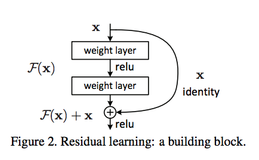

## CIFAR 10 dataset visualization using Resnet 18 CNN model

### Authors

* **Deepak Hazarika** 
* **Parinita Bora**
* **Gurudatta**

9/19/2020 12:18:41 PM 

----------

## Source code for model , train , test , torchsummary and loaddata

Source code for the above modules are in git package

1.  https://github.com/tfdeepnet/visionlib/tree/master/utils
2.  https://github.com/tfdeepnet/visionlib/tree/master/models

## Resnet design philosophy

Residual Networks, or ResNets, learn residual functions with reference to the layer inputs, instead of learning unreferenced functions. Instead of hoping each few stacked layers directly fit a desired underlying mapping, residual nets let these layers fit a residual mapping. They stack residual blocks ontop of each other to form network: e.g. a ResNet-50 has fifty layers using these blocks.

Formally, denoting the desired underlying mapping as 

, we let the stacked nonlinear layers fit another mapping of  

The original mapping is recast into 

There is empirical evidence that these types of network are easier to optimize, and can gain accuracy from considerably increased depth.

(ref -[https://paperswithcode.com/method/resnet](https://paperswithcode.com/method/resnet "resnet model") 

## Resnet model

This is resnet18 model with the following configuration

- 4 basic block with 2 residual block in each basic block
	- Basic block 1
		- input and output channel = 64
		- stride = 1
		- There are 2 residual block and each resiudal block has the following configuration
			- Conv2D -> Batch Norm -> Relu -> Conv2d -> Batch Norm
			- The input to residual block is added to output of the Batch norm
			- Apply relu to the above output
			
	- Basic block 2 --- 4
		- input and output channel 
			- basic block 2 = 128
			- basic block 3 = 256
			- basic block 4 = 512
			
		- stride = [2 , 1]
		- There are 2 residual block , first resiudal block has the following configuration
			- First Conv2d has a stride of 2 , which downsamples the image by half
			- Conv2D -> Batch Norm -> Relu -> Conv2d -> Batch Norm 
			- 1x1 Conv2D of the input to increase the channel from 64 -> 128. This is then added to output of the Batch norm
			- Apply relu to the above output 
		
		- Second resiudal block has the following configuration
			- Conv2D -> Batch Norm -> Relu -> Conv2d -> Batch Norm 
			- The input to residual block is added to output of the Batch norm
			- Apply relu to the above output 
					   

	- Linear layer which reduces the channels from 512 to 10 to match the number of image classes.
The resnet model is picked from the following source. 

https://github.com/kuangliu/pytorch-cifar

## Receptive field calculation of Resnet 18 CNN model

| Layer (type)                 |               Output Shape  |            Param #  |             RF out  |            Jump in |
|------------------------------|-----------------------------|---------------------|---------------------|--------------------|
| Conv2d-1                     |           [-1, 64, 32, 32]  | 1,728               | 3                   | 1                  |
| BatchNorm2d-2                |           [-1, 64, 32, 32]  | 128                 | 0                   | 0                  |
| Conv2d-3                     |           [-1, 64, 32, 32]  | 36,864              | 5                   | 1                  |
| BatchNorm2d-4                |           [-1, 64, 32, 32]  | 128                 | 0                   | 0                  |
| Conv2d-5                     |           [-1, 64, 32, 32]  | 36,864              | 7                   | 1                  |
| BatchNorm2d-6                |           [-1, 64, 32, 32]  | 128                 | 0                   | 0                  |
| BasicBlock-7                 |           [-1, 64, 32, 32]  | 0                   | 0                   | 0                  |
| Conv2d-8                     |           [-1, 64, 32, 32]  | 36,864              | 9                   | 1                  |
| BatchNorm2d-9                |           [-1, 64, 32, 32]  | 128                 | 0                   | 0                  |
| Conv2d-10                    |           [-1, 64, 32, 32]  | 36,864              | 11                  | 1                  |
| BatchNorm2d-11               |           [-1, 64, 32, 32]  | 128                 | 0                   | 0                  |
| BasicBlock-12                |           [-1, 64, 32, 32]  | 0                   | 0                   | 0                  |
| Conv2d-13                    |          [-1, 128, 16, 16]  | 73,728              | 13                  | 1                  |
| BatchNorm2d-14               |          [-1, 128, 16, 16]  | 256                 | 0                   | 0                  |
| Conv2d-15                    |          [-1, 128, 16, 16]  | 147,456             | 17                  | 2                  |
| BatchNorm2d-16               |          [-1, 128, 16, 16]  | 256                 | 0                   | 0                  |
| Conv2d-17                    |          [-1, 128, 16, 16]  | 8,192               | 17                  | 2                  |
| BatchNorm2d-18               |          [-1, 128, 16, 16]  | 256                 | 0                   | 0                  |
| BasicBlock-19                |          [-1, 128, 16, 16]  | 0                   | 0                   | 0                  |
| Conv2d-20                    |          [-1, 128, 16, 16]  | 147,456             | 25                  | 4                  |
| BatchNorm2d-21               |          [-1, 128, 16, 16]  | 256                 | 0                   | 0                  |
| Conv2d-22                    |          [-1, 128, 16, 16]  | 147,456             | 33                  | 4                  |
| BatchNorm2d-23               |          [-1, 128, 16, 16]  | 256                 | 0                   | 0                  |
| BasicBlock-24                |          [-1, 128, 16, 16]  | 0                   | 0                   | 0                  |
| Conv2d-25                    |            [-1, 256, 8, 8]  | 294,912             | 41                  | 4                  |
| BatchNorm2d-26               |            [-1, 256, 8, 8]  | 512                 | 0                   | 0                  |
| Conv2d-27                    |            [-1, 256, 8, 8]  | 589,824             | 57                  | 8                  |
| BatchNorm2d-28               |            [-1, 256, 8, 8]  | 512                 | 0                   | 0                  |
| Conv2d-29                    |            [-1, 256, 8, 8]  | 32,768              | 57                  | 8                  |
| BatchNorm2d-30               |            [-1, 256, 8, 8]  | 512                 | 0                   | 0                  |
| BasicBlock-31                |            [-1, 256, 8, 8]  | 0                   | 0                   | 0                  |
| Conv2d-32                    |            [-1, 256, 8, 8]  | 589,824             | 89                  | 16                 |
| BatchNorm2d-33               |            [-1, 256, 8, 8]  | 512                 | 0                   | 0                  |
| Conv2d-34                    |            [-1, 256, 8, 8]  | 589,824             | 121                 | 16                 |
| BatchNorm2d-35               |            [-1, 256, 8, 8]  | 512                 | 0                   | 0                  |
| BasicBlock-36                |            [-1, 256, 8, 8]  | 0                   | 0                   | 0                  |
| Conv2d-37                    |            [-1, 512, 4, 4]  | 1,179,648           | 153                 | 16                 |
| BatchNorm2d-38               |            [-1, 512, 4, 4]  | 1,024               | 0                   | 0                  |
| Conv2d-39                    |            [-1, 512, 4, 4]  | 2,359,296           | 217                 | 32                 |
| BatchNorm2d-40               |            [-1, 512, 4, 4]  | 1,024               | 0                   | 0                  |
| Conv2d-41                    |            [-1, 512, 4, 4]  | 131,072             | 217                 | 32                 |
| BatchNorm2d-42               |            [-1, 512, 4, 4]  | 1,024               | 0                   | 0                  |
| BasicBlock-43                |            [-1, 512, 4, 4]  | 0                   | 0                   | 0                  |
| Conv2d-44                    |            [-1, 512, 4, 4]  | 2,359,296           | 345                 | 64                 |
| BatchNorm2d-45               |            [-1, 512, 4, 4]  | 1,024               | 0                   | 0                  |
| Conv2d-46                    |            [-1, 512, 4, 4]  | 2,359,296           | 473                 | 64                 |
| BatchNorm2d-47               |            [-1, 512, 4, 4]  | 1,024               | 0                   | 0                  |
| BasicBlock-48                |            [-1, 512, 4, 4]  | 0                   | 0                   | 0                  |
| Linear-49                    |                   [-1, 10]  | 5,130               | 0                   | 0                  |
| ResNet-50                    |                   [-1, 10]  | 0                   | 0                   | 0                  |
| Total params: 11,173,962     |                             |                     |                     |                    |
| Trainable params: 11,173,962 |                             |                     |                     |                    |
| Non-trainable params: 0      |                             |                     |                     |                    |

## The final receptive field of the network is 473.

## The model achieved a test accuracy of 86% and individual class accuracy is given below.

| Class | Test accuracy |
| ----- | ------------- |
| plane | 89%           |
|   car | 95%           |
|  bird | 80%           |
|   cat | 70%           |
|  deer | 84%           |
|   dog | 80%           |
|  frog | 85%           |
| horse | 91%           |
|  ship | 93%           |
| truck | 96%           |
 

## Deployment

The python notebook can be run as it is.The required libraries are imported in the notebook.

Reference

1- Embed latex in markdown - https://gist.github.com/a-rodin/fef3f543412d6e1ec5b6cf55bf197d7b
