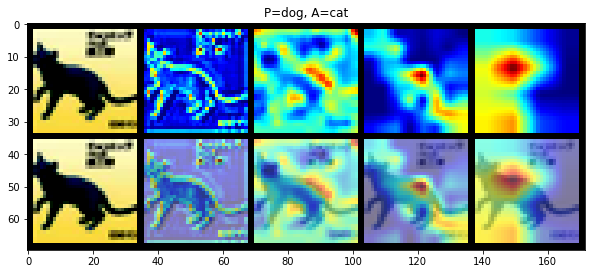
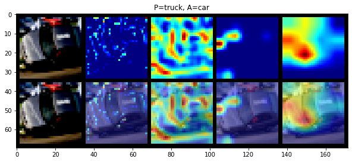

## CIFAR 10 dataset visualization using Resnet 18 CNN model , albumentation data augmentation library and Grad cam visualization

### Authors

* **Deepak Hazarika** 
* **Parinita Bora**
* **Gurudatta**

10/2/2020 4:49:49 PM  

----------

## Source code for model , train , test , torchsummary and loaddata etc

Source code for the above modules are in git package

1.  https://github.com/tfdeepnet/visionlib/tree/master/utils
2.  https://github.com/tfdeepnet/visionlib/tree/master/models

## Cifar 10 images

Cifar 10 images are stored in a local folder and the same is accessed at runtime.

## Image augmentation used on the train dataset

- A.HueSaturationValue - randomly change the hue , saturation and value of  input image 
- A.ShiftScaleRotate - Randomly apply affine transforms: translate, scale and rotate the input
- A.HorizontalFlip

## The model achieved a test accuracy of 88% in 15 epochs and individual class accuracy is given below.

| Class | Accuracy |
| ----- | -------- |
| plane | 90%      |
|  car  | 95%      |
| bird  | 84%      |
|  cat  | 76%      |
| deer  | 89%      |
|  dog  | 81%      |
| frog  | 91%      |
| horse | 92%      |
| ship  | 93%      |
| truck | 92%      |

## Grad cam visualization

Cat image
 

Truck image

(source code for grad cam cloned from https://github.com/aimbsg/EVA4_S10/blob/master/)

## Deployment

The python notebook can be run as it is.The required libraries are imported in the notebook.

