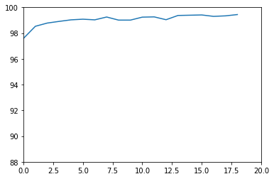

## Testing MNIST dataset using Neural Network

### A few words about MNIST dataset:

*The MNIST database of handwritten digits, available from this page, has a training set of 60,000 examples, and a test set of 10,000 examples. It is a subset of a larger set available from NIST. The digits have been size-normalized and centered in a fixed-size image.(source - http://yann.lecun.com/exdb/mnist/)*

### Model summary

A CNN model is used to test the MNIST dataset and predict the value of the handwritten digit.The model is as given below:

| Layer   |   Input  |  Output  | Kernel size | Receptive field |
|:---------:|:--------:|:--------:|:-----------:|:---------------:|
| Conv1   |  28x28x1 | 26x26x14 |     3x3     |        3        |
| Conv2   | 26x26x14 | 24x24x30 |     3x3     |        5        |
| Pool1   | 24x24x30 | 12x12x30 |     2x2     |        10       |
| Conv3   | 12x12x30 | 12x12x14 |     1x1     |        10       |
| Conv4   | 12x12x14 | 10x10x30 |     3x3     |        12       |
| Conv5   | 10x10x30 |  8x8x39  |     3x3     |        14       |
| Conv6   |  8x8x39  |  8x8x10  |     1x1     |        14       |
| AvgPool |  8x8x10  |  1x1x10  |      -      |        14       |
 
### Model parameters

Some of the common parameters are initialized for optimal performance

*Batch size = 64*

*learning rate = 0.018*

*Optimizer = Stochastic gradient descent* 

### *The network is built to meet the following constraints*

* 99.4% validation accuracy
* Less than 20k Parameters
* Less than 20 Epochs
* No fully connected layer

## Implementation detail

### Helper function to load train and test mnist data

#### The following transforms are done on the train data

##### *RandomAffine* - An affine transformation is any transformation that preserves collinearity (i.e., all points lying on a line initially still lie on a line after transformation) and ratios of distances (e.g., the midpoint of a line segment remains the midpoint after transformation).

##### *RandomCrop* - Part of image is randomly blacked out

#### In addition the following transforms are done on both train and test data

##### *shuffle* - flag is set to true

##### *Normalize* - image  is normalized with a mean of 0.1307 and std. deviation of 0.3081

### Helper method to train the data

For each batch
	
	Initialize the gradient to 0

	do a forward pass

	calculate the loss

	backpropogate to adjust the model weights

### Helper method to train the data

For each batch

	set the model to evaluation mode

	evaluate each batch

	compare the predicted value with actual value of the digit

	find the loss

calculate the overall accuracy = true prediction/ total no of test records

## Now run the model and calculate accuracy

* run the model for 19 epochs and check the model accuracy.

*Fig 1: Plot of test accuracy  vs epoch number*	

### * In this run the model achieved an accuracy of 99.44%